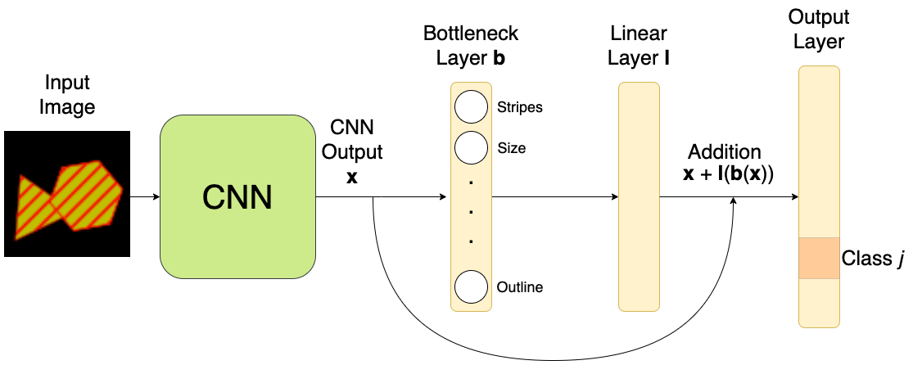
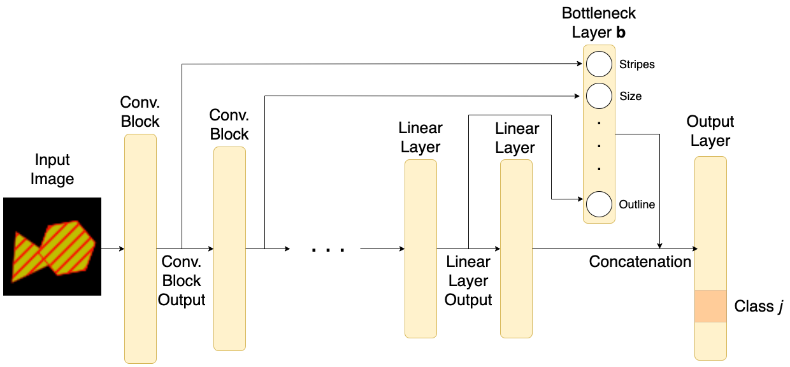
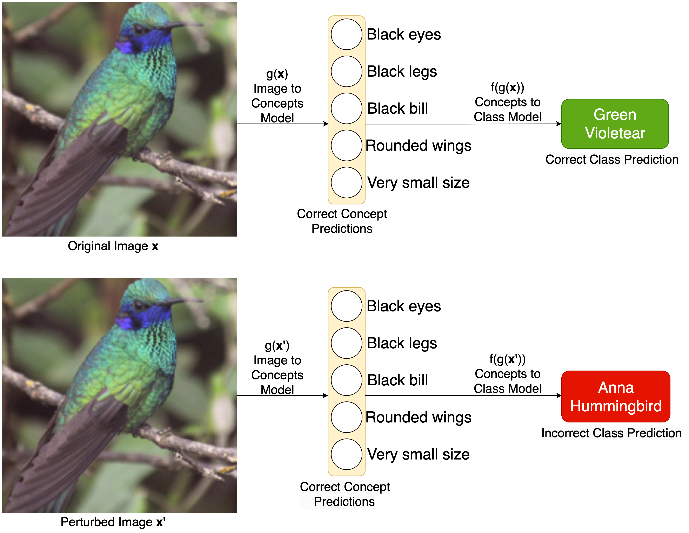

# Hybrid Concept-based Models

This is the working repository for my (Tobias Opsahl's) master thesis in Data Science from the University of Oslo, defended January 31 2024. The thesis can be downloaded [here](https://www.duo.uio.no/handle/10852/110048). This repository is made public in order to easily verify the experiments from the thesis. In order to load the code as it was in the state of the thesis delivery (December 15th 2023), please use the tag `v1.0-thesis`. The code has been slightly updated to have better documentation, formatting and readability, while no significant change to the code has been done. It is therefore recommended to use the current version of the repository instead.

For the ConceptShapes datasets, please go to the [ConceptShapes repository](https://github.com/Tobias-Opsahl/ConceptShapes). It has been updated with better documentation and flexibility for the user. The ConceptShapes datasets were used in the thesis as part of this code, and are therefore kept here for reproducibility.

## Overview

Here is a brief overview over the sections in this README.md.

- **Summary:** Summarises the contributions this code was used for.
- **Dependencies:** Contains instructions on which libraries are used and how to easily install them.
- **Datasets:** Contains information about how to download the datasets used.
- **File Structure:** Provides an overview over how the repository is structured.
- **How to Run the Code:** Contains information about how to run the code.

## Summary

The main contributions from the thesis that this repository provides code for are listed below.

### 1) Hybrid Concept-based Models

We propose two new neural network architectures, that we call *hybrid concept-based models*. The models make the downstream prediction by combining concept predictions and information interfering with the concepts. They are inspired by earlier proposed concept-based models, such as the *Concept Bottleneck Model* (CBM) [(paper link)](https://proceedings.mlr.press/v119/koh20a). The models train to minimise a weighting of the downstream target loss and a loss function for the concepts.

The first model connects a skip connection jumping over the concept prediction layer. The output from the skip connection can either be added or concatenated with the concept predictions before being used in the output layer. We refer to the model as *CBM-Res* if it use addition, and *CBM-Skip* if it uses concatenation.


*Illustration of the CBM-Res architecture. The addition can be changed with concatenation for the CBM-Skip.*

The other model predicts the concepts sequentially through the layers, instead of all at once. We call it the *Sequential Bottleneck Model* (SCM). The concept predictions are concatenated together, along with the final hidden layer, which is used as input to the classification layer.


*Illustration of the SCM architecture.*

### 2) ConceptShapes

The thesis argues that current concept datasets has various shortcomings, so in order to properly benchmark the models, we propose our own class of synthetic concept datasets, called *ConceptShapes*. The amount of classes, concepts, and relationship between concepts and classes can be adjusted by the user. Datasets can be quickly generated, or downloaded from the [releases](https://github.com/Tobias-Opsahl/ConceptShapes/releases). We made a separate repository explaining the datasets in detail, along with the most user-friendly documentation and code to generate, process and load the data, which can be [found here](https://github.com/Tobias-Opsahl/ConceptShapes).

### 3) Adversarial Concept Attacks

Previous concept-based models have been motivated by interpretability. Since the CBM uses only concept predictions in order to predict the output, the model's behaviour can be explained by its concept predictions. However, several experiments challenge this claim, and show that more information than just the concepts are embedded in the concept predictions [(article 1)](https://arxiv.org/abs/2106.13314) [(article 2)](https://arxiv.org/abs/2105.04289). We further put the promised interpretable qualities into questions by creating *adversarial concept attacks*.

We construct an algorithm that, given a CBM and an input image, produces a perturbed image that looks identical to humans, producing the exact same concept predictions, but different target predictions. Since the concept predictions are used as the interpretation of the model's behaviour, but two identical interpretations give two vastly different model behaviours, we believe this challenges the interpretable qualities of concept-based models.


*Example of Adversarial Concept Attack. The image is perturbed so that the concept predictions remain the same, but the downstream target prediction is changed.*

Adversarial Concept Attacks differs from [this paper](https://ojs.aaai.org/index.php/AAAI/article/view/26765), which constructs adversarial attack algorithm that changes the concept predictions, but keeps the class prediction the same.

## Dependencies

Here are the specific versions of the libraries used:

- **Numpy:** 1.25.2 (for everything)
- **Matplotlib:** 3.5.3 (for creating ConceptShapes and plotting)
- **Torch:** 2.0.1 (for running neural nets and dataloaders)
- **Torchvision:** 0.15.2 (for running neural nets and dataloaders)
- **Optuna:** 3.3.0 (for hyperparameter searches)
- **Scikit-learn** 1.0.2 (for various metrics)
- **Pillow:** 10.2.0 (for plotting)
- **Pyyaml:** 6.0.1 (for loading yaml files, reading and writing hyperparameters)

and **Python** version 3.10.12.

### Installing Dependencies with Conda

- Run `conda env create -f environment.yaml` to create the conda environment.
- Run `conda activate conceptshapes_env` to activate the environment.

### Installing Dependencies with pip

- (Optional, but recommended) Create a virtual environment:
  - `python -m venv conceptshapes_venv`
  - Activate the environment:
    - On Windows: `conceptshapes_venv\Scripts\activate`
    - On macOS and Linux: `source conceptshapes_venv/bin/activate`
- Install the required packages: `pip install -r requirements.txt`

## Datasets

### ConceptShapes

ConceptShapes is a flexible synthetic class of concept datasets, originally proposed in this Thesis. It provides an easy way to generate datasets with concept labels, where the user can choose the amount of classes, amount of concepts and the relationship between them. Many versions of the datasets were used in the experiments in the thesis. The code for creating the datasets is provided in this repository, but we recommend to use [this updated](https://github.com/Tobias-Opsahl/ConceptShapes) repository, or download from its releases. See the README.md there for more information about the datasets.

All of the ConceptShapes datasets are light and can be trained and evaluated on an ordinary laptop's CPU in a couple of minutes. Please put the datasets in the `data/shapes/` folder, illustrated in `File Structure`.

### CUB

The Caltech-USCD Birds-200-2011 (CUB) [(paper link)](https://www.florian-schroff.de/publications/CUB-200.pdf) consists of $N = 11 788$ images of birds, where the target is labeled among 200 bird species. The original dataset contains 28 categorical concepts, which makes 312 binary concepts when one-hot-encoded. The processed version [(paper link)](https://proceedings.mlr.press/v119/koh20a) used for benchmarking concept-based models majority voted the concepts so that every class has the exact same concepts and removed sparse concepts, ending up with 112 binary concepts. The CUB dataset is the most widely used concept dataset, and it was therefore also used to benchmark the hybrid concept-based models.

The original dataset and the processed version can be downloaded [here](https://worksheets.codalab.org/worksheets/0x362911581fcd4e048ddfd84f47203fd2). Please download `CUB_200_2011` and `CUB_processed`, and put them in the `data/` folder.

The processed dataset has absolute paths with the authors' name, so it needs to be changed to relative paths. In order to do so, simply run:

```cli
python initialize.py
```

This will loop over the processed data table and change the absolute paths to relative paths.

## File Structure

Most of the source code is saved in `src/`, while the data should be saved in `data/`. For running experiments, please use `run_cub.py` and `run_shapes.py` with command line arguments, explained in the section `Example Runs`. Below is an overview of the filetree. The file `run_make_datasets_shapes.py` was originally used to make the ConceptShapes datasets, but we recommend to use [this repo](https://github.com/Tobias-Opsahl/ConceptShapes) instead.

```filetree
data/
└── shapes/
   ├── shapes_1k_c10_a5_s100/
   ├── shapes_1k_c10_a9_s100/
   └── ... other conceptshapes datasets
└── CUB_200_2011/
   └── ... original CUB dataset
└── CUB_processed
   └── class_attr_data_10
       └── ... processed datatables
src/
└── common/
   └── ... utility functions
└── datasets/
   └── ... code for loading and processing datasets
└── models/
   └── ... code for the models
└── ... other source code files (training, evaluating, hyperparameters search, ...)
results/
└── adversarial/
   └── ... contains information about adversarial concept attacks
└── history/
   └── ... contains training histories and evaluation metrics
└── hyperparameters/
   └── ... contains best hyperparameters found
└── saved_models/
   └── ... contains state dictionaries for the best models.
run_cub.py
run_make_datasets_shapes.py
run_shapes.py
```

## How to Run the Code

Once the desired dataset is downloaded and the dependecies are installed, the code can be run. The code is run by either running `python run_shapes.py` or `python run_cub.py` with command line arguments explained below, which runs experiments on ConceptShapes and CUB, respectively. The file `run_make_datasets_shapes.py` was used for generating the ConceptShapes datasets, but we once again refer to [this repository](https://github.com/Tobias-Opsahl/ConceptShapes) for better documentation and code. Please run the files with `-h` to see the full list of command line arguments.

ConceptShapes can be run on an ordinary laptop's CPU, but we recommend using a GPU when using the full CUB dataset.

**Tip:** In order to quickly test the code, it can be run with `--fast`, which runs very few epochs when training. If `--n_subset` is not specified, it will be run on a very small subset of the data, which will make the code run very fast. This is very convenient for checking that everything works before doing the full run. When running hyperparameter searches, also add `--n_trials 1` to terminate after a single run.

When running CUB, remember to run `python initialize.py` in order to correct the CUB paths.

### ConceptShapes Dataset Specification

When using ConceptShapes, the arguments specifying the specific dataset needs to be provided. This can be done as below:

```cli
python run_shapes.py --python run_shapes.py --n_classes 10 --n_attr 9 --signal_strength 98 ...
```

Here `n_classes` is the amount of classes (10, 15 or 21), `n_attr` is the amount of concepts (5 or 9), and `signal_strength` is the parameter `s` indicating the relatinship between the concepts and the classes (between 50 and 100). The example above will use the 10 class 9 concept ConcetShapes dataset with signal strength 98%.

### Subsets

The experiments were conducted on many different subsets of the datasets, in order to investigate how the amount of data influenced the performance. The specific subsets to use can be specified with `--subsets <subsets>`. The default value for this is very small, so that the code can be quickly tested, so this argument should always be provided. The argument can be a single number, or a list of numbers separated with commas (and not whitespace). The numbers indicate the amount of images of each class to use in the training and validation dataset. For CUB, `30` will be interpreted as the full dataset.

For the ConceptShapes datasets, we used the following subsets:

```cli
python run_shapes.py --subsets 50,100,150,200,250 ...
```

while for CUB, we used:

```cli
python run_cub.py --subsets 5,10,15,20,25,30
```

In order to only run on the full CUB dataset, one can use `--subsets 30`.

### Training, Evaluating and Plotting

One can train, evaluate and plot the results by passing `--evaluate_and_plot`. This will use the best hyperparameters to train the models, evaluate it on the test-set, and plot results. If no hyperparameters are searched for yet (see below), this will just use defualt hyperparameters instead. The argument `--n_bootstrap <n>` specified how many times to draw subsets that each model is trained and tested on, which was 10 for ConceptShapes and 3 for CUB.

Here are some example runs:

```cli
python run_shapes.py --evaluate_and_plot --n_classes 10 --n_attr 9 --signal_strength 98 --subsets 50,100,150,200,250 --n_bootstrap 10
```

```cli
python run_cub.py --evaluate_and_plot --subsets 5,10,15,20,25,30 --n_bootstrap 3 --num_workers 2 --persistent_workers --pin_memory --non_blocking
```

One can use `--only_plot` to only plot the results from training, which are stored in `results/history/`. Additionally, `--models <models>` can be used to specify which models to use.

### Hyperparameter Search and Training

In order to run hyperparameter searches, use `--run_hyperparameters`. This will use a grid-search, but one can also pass `--no_grid_search` to use Optunas TPESampler. The hyperparameters to tune for are specified in `src/hyperparameter_optimization.py` and `src/hyperparameter_optimization_cub.py`, and can be changed there. If so, choose the hyperparameters to search for in `run_hyperparameter_optimization_all_models`, and the search spaces in `_get_search_space()`.

Hyperparameter searches will be conducted for every model (can be changed with `--models <models>`) for every subset. The results will be saved in `results/hyperparameters/`, `results/history/` and `results/saved_models/`. Here are some example runs:

```cli
python run_shapes.py --run_hyperparameters  --n_classes 10 --n_attr 9 --signal_strength 98 --subsets 50,150,200
```

```cli
python run_cub.py --run_hyperparameters --subsets 30 --num_workers 2 --pin_memory --non_blocking
```

### Additional Arguments

The argument `--hard_bottleneck` can be provided to use a hard bottleneck for the concept models, which rounds off the concept predictions before passing them forward in the network. If not provided, the bottleneck will default to soft (sigmoided) concept predictions.

One can provide `--models <models>` in order to run a specific model, or set of models.

The logging verbosity is controlled by `--logging_level <verbosity_level>` and `--optuna_verbosity <verbosity_level>`

The argument `--device <device>` specifies whether the experiments are ran on CPU or CUDA, and will default to CUDA if it is available.

Other hardware arguments are `--non_blocking`, which will make the RAM to VRAM asynchronous (when using CUDA). The argument `--num_workers <n>` specifies the amount of nodes to use to load data to RAM, and `--pin_memory` will make the RAM non-pagable. Finally, `--persistent_workers` wil stop the workers from reloading between epochs.

### Adversarial Concept Attacks

Use `--run_adversarial_attacks` to run adversarial concept attacks. If the model to run on is not trained, also pass `--train_model`. Use the argument `--adversarial_grid_search` to perform a grid search on the hyperparameters. There are various hyperparameters that can be changed as well. Here are some example runs:

```cli
python run_shapes.py --adversarial_grid_search --n_classes 10 --n_attr 9 --signal_strength 98 --max_steps 800 --max_images 200
```

```cli
python run_shapes.py --run_adversarial_attack --n_classes 10 --n_attr 9 --signal_strength 98 --max_steps 800 --max_images 10000 --grad_weight 0.999 --logging_level debug
```

```cli
python run_cub.py --run_adversarial_attacks --train_model --epsilon 0.1 --alpha 0.001 --max_images 10 --logging_level debug --num_workers 2 --persistent_workers --pin_memory --non_blocking
```


### Error Messages

If you get something like:

```cli
No such file or directory: '/juice/scr/scr102/scr/thaonguyen/CUB_supervision/datasets/CUB_200_2011/images/ ...
```

when running CUB, it is because you have not changed the CBM authors' absolute path to a relative one. See the `CUB` section above.
